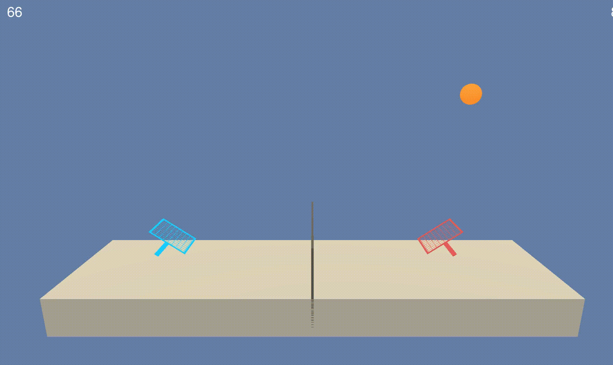
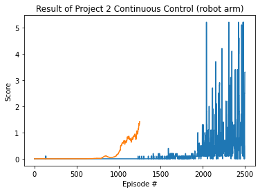

# project 3 : Tennis
This repo deal with a second deep reinforcement learing project of udacity.
In the project, I will implement a multi agent learning.

**Note : The version of pytorch is 1.4.0. The original version from udacity is 0.4.0. Due to the version of numpy, I upgraded the version of pytorch.**

## **Prerequisites**
- OS: Ubuntu 20.04
- anaconda
- setup virtual environment using 'python' folder

## How to start
This project is supposed that you have anaconda.

**0. clone this repository**
```bash
mkdir project_1
cd project_1
git clone https://github.com/yesming/project3_multi_agent_tennis.git
```
Now you can see the repository 'project_1_navigation'.

**1. activate virtual environment**
```bash
conda create --name drlnd python=3.6
source activate drlnd
```

**2. Environment setup and Execute**
```bash
cd p1_navigation/python
pip install .
```
you can see the file **'./p3_collab-compet/My_Tennis.ipynb'**
Execute the file on the jupyter environment.

-------

## Goal of Project
In this project, the goal of learning is to keep the game going for a long time.

## Environment (Reward and Evaluate)
Each agent receives its own, local observation. (So, multi-agent learning).
If an agent hits the ball over the net, it receives a reward of +0.1. If an agent lets a ball hit the ground or hits the ball out of bounds, it receives a reward of -0.01.

## State Space
There are 2 agents. Each observes a state with length: 24.

## Actions
Two continuous actions

```bash
movement toward(or away from) the net, and jumping
```

## Result
The agent was successfully learned the purpose. At the end of learning, the agents get a reward more than 0.5.

Video of the early phase :


Video of the final phase


The history of reward
