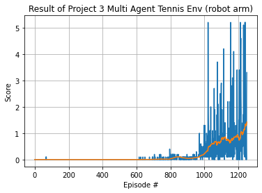

# Udacity - Deep Reinforcement Learning
## Final Project - **Collaboration and Competition**
------
------
# Table of Contents
- [Environment](#environment)
- [State Space](#state-space)
- [Actions](#actions)]

## Environment
Each agent receives its own, local observation. (So, multi-agent learning).
If an agent hits the ball over the net, it receives a reward of +0.1. If an agent lets a ball hit the ground or hits the ball out of bounds, it receives a reward of -0.01.

## Purpose of Learning
The purpose of this project or the agent is to keep game going as long as possible.

## State Space
The observation space consists of 8 variables corresponding to the position and velocity of the ball and racket.

## Actions
Continuous actions is given for each agents.
movement toward (or away from) the net, and jumping.

## Learning Algorithm
Multi-Agent DDPG is implemented.

The input layer of Actor is consists of 24(= length of observed state).
And the output layer of 2(move, jump) neurons.

Note that the input layer of Critic is consists of 400 + 48 (=2 times length of ovserved state.). The number 400 can be changed, but the @ value is determined by the length of observed state.
An output layer have 1 neurons.

## Hyper parameter
```python
BUFFER_SIZE = int(1e6)  # replay buffer size
BATCH_SIZE = 128        # minibatch size
GAMMA = 0.99            # discount factor
TAU = 1e-3              # for soft update of target parameters
LR_ACTOR = 1e-4         # learning rate of the actor 
LR_CRITIC = 3e-4        # learning rate of the critic
WEIGHT_DECAY = 0        # L2 weight decay
```

## Result 
Agents learned the strategy how to play the tennis its for about 1200 episodes. The average scores, the yellow line in below figure, is over the 0.5. it's almost 1.5 points.
And, the weights of Action and Critic are stored in *.pth files.

The below figure and videos show that the learning project is sucessful.

(Sorry for the typo on the figure. ~~robot arm~~)




## Future Work
The performance of the agents can be improved.
- I want to compare the progress of learning according to the random seed.
- I want to try implementing Multi-game multi-agent learning like the second project. For example, 20 games are played at the same time.
- Other action or critic methods can be implemented and compared.
